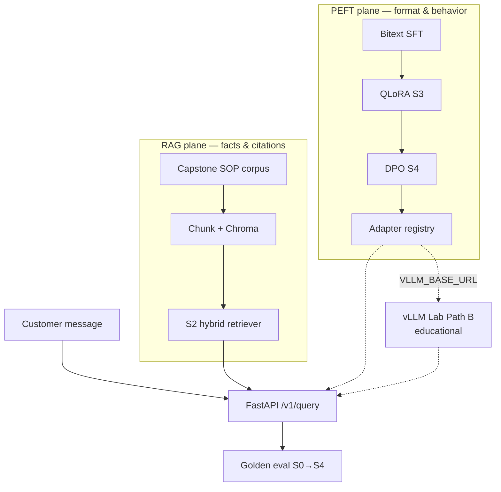

# DomainForge — Governed Support Triage Pipeline


<!-- vpeetla-tech-stack:start -->
[]() []() []() []() []() []() []() []()
<!-- vpeetla-tech-stack:end -->
## Agent skills (Cursor + Codex)

Org skills: [vpeetla-ai-skills](https://github.com/vpeetla-ai/vpeetla-ai-skills). This repo includes `.cursor/skills/`, `AGENTS.md`, and `CONTEXT.md`.

```bash
git clone https://github.com/vpeetla-ai/vpeetla-ai-skills.git
./vpeetla-ai-skills/scripts/install.sh --cursor --codex --project .
```

---

[](https://domainforge-rag-peft.vercel.app)
[](https://domainforge-api.onrender.com/health)
[](LICENSE)

**Fine-tune behavior, retrieve facts** — QLoRA SFT + DPO alignment for strict JSON triage over a capstone SOP corpus, with a unified **S0→S4** eval harness.

[▶ Live demo](https://domainforge-rag-peft.vercel.app) · [API health](https://domainforge-api.onrender.com/health) · [Local AI bench](/bench) · [Case study](https://github.com/vpeetla-ai/ai-architecture-portfolio/blob/main/case-studies/domainforge-rag-peft.md)

**Portfolio:** [Case study](https://github.com/vpeetla-ai/ai-architecture-portfolio/blob/main/case-studies/domainforge-rag-peft.md) · [ADR-019 RAG vs PEFT](https://github.com/vpeetla-ai/ai-architecture-portfolio/blob/main/adr/ADR-019-rag-facts-peft-behavior.md) · [ADR-022 vLLM Path B (educational, shipped)](https://github.com/vpeetla-ai/ai-architecture-portfolio/blob/main/adr/ADR-022-domainforge-vllm-multi-lora-serving.md)

## What this is

**DomainForge** is the org's **RAG + MLOps adaptation layer** for customer-support triage: grounded citations from SOPs plus reliable JSON routing schemas — without fine-tuning stale policies into the model weights.

| Layer | Repo | Live |
|-------|------|------|
| Knowledge (access-aware RAG) | [enterprise_rag_platform](https://github.com/vpeetla-ai/enterprise_rag_platform) | [enterprise-rag-platform-eta.vercel.app](https://enterprise-rag-platform-eta.vercel.app) |
| **This project** | `domainforge-rag-peft` | [domainforge-rag-peft.vercel.app](https://domainforge-rag-peft.vercel.app) |
| Inference education | [vllm-architecture-lab](https://github.com/vpeetla-ai/vllm-architecture-lab) | [vllm-architecture-lab.vercel.app](https://vllm-architecture-lab.vercel.app) |
| Voice consumer | [voiceforge-assistant](https://github.com/vpeetla-ai/voiceforge-assistant) | [voiceforge-assistant.vercel.app](https://voiceforge-assistant.vercel.app) |

## How we solve it

| Problem | Approach |
|---------|----------|
| Base models invent `chunk_id`s | **RAG plane** — hybrid retrieval over capstone SOP corpus |
| RAG-only models break JSON schema | **PEFT plane** — QLoRA SFT + DPO on Bitext labels |
| Can't prove which layer helps | **S0→S4 eval ladder** — compare solutions on golden set |
| Irreversible adapter promotion | API-key gated `promote`; blocked on regression |

**Separation:** RAG = facts · PEFT = schema / intent / action codes ([ADR-001](docs/adr/ADR-001-rag-vs-peft-separation.md) · [ADR-019](https://github.com/vpeetla-ai/ai-architecture-portfolio/blob/main/adr/ADR-019-rag-facts-peft-behavior.md))

## Architecture

Canonical: [`docs/diagrams/canonical-architecture.mmd`](docs/diagrams/canonical-architecture.mmd)



## Honest status

| Component | Status | Notes |
|-----------|--------|-------|
| SOP ingest + hybrid RAG (S1/S2) | ✅ | Chroma + BM25 lexical |
| QLoRA training + DPO (S3/S4) | ✅ | `domainforge-train` CLI |
| Preference pairs + win-rate | ✅ | `/v1/preferences/samples` |
| Adapter registry + promote gate | ✅ | API-key on promote |
| Live API + UI | ✅ | Render + Vercel |
| Glass-box workbench UX | ✅ | Architecture rail + S0→S4 pipeline replay + product panel (`ui/components/GlassboxWorkbench.tsx`) |
| Ollama inference | ✅ | `MOCK_LLM=false` + GPU host |
| Ollama bench UI | ✅ | `/bench` route |
| Golden eval CI gate | ✅ | `domainforge.triage_preference_v1` |
| Full Mistral QLoRA on GPU | 🟡 | `scripts/gpu_pipeline.sh` — user RunPod |
| vLLM Path B (educational, shipped) | ✅ | OpenAI-compatible `/v1/chat/completions` via `VLLM_BASE_URL` → [vLLM Lab](https://github.com/vpeetla-ai/vllm-architecture-lab); not CUDA multi-LoRA ([ADR-022](https://github.com/vpeetla-ai/ai-architecture-portfolio/blob/main/adr/ADR-022-domainforge-vllm-multi-lora-serving.md)) |
| LLM gateway plane | ✅ | When `LLM_GATEWAY_URL` set — DomainForge **selects** cascade; [aegis-llm-gateway](https://github.com/vpeetla-ai/aegis-llm-gateway) **enforces+records** (ADR-028/029) before vLLM/Ollama/baseline |

## Quick start

```bash
python -m venv .venv && source .venv/bin/activate
pip install -e ".[dev]"
make chunk-sops && make test && make eval-compare
make api   # http://localhost:8090/health
```

**UI (local):**

```bash
cd ui && NEXT_PUBLIC_API_URL=http://localhost:8090 npm run dev
```

**GPU → Ollama:** [docs/GPU_OLLAMA_PIPELINE.md](docs/GPU_OLLAMA_PIPELINE.md)

## Solution ladder

| ID | Description |
|----|-------------|
| S0 | Base model, no retrieval |
| S1 | Naive RAG |
| S2 | Hybrid governed RAG |
| S3 | PEFT + S2 |
| S4 | DPO + S3 |

## Deploy

| Target | URL / config |
|--------|----------------|
| API (Render) | [domainforge-api.onrender.com](https://domainforge-api.onrender.com) — cold start ~30s |
| UI (Vercel) | `ui/` static export · `NEXT_PUBLIC_API_URL` |

> **First-run note:** The Render API sleeps after inactivity on the free tier. The first request takes ~30s to wake. The UI surfaces a "waking API" state and falls back to a template baseline if the API is unreachable.

## Interview map

**Business function:** RAG for facts + PEFT for behavior — customer-support triage with grounded citations and schema reliability.

Staff+ prep crosswalk — [playbook](https://github.com/vpeetla-ai/ai-architect-interview-playbook) · [study UI](https://ai-architect-interview-playbook.vercel.app) · [Practice Arena](https://ai-architect-practice-arena.vercel.app) · [org matrix](https://github.com/vpeetla-ai/ai-architecture-portfolio/blob/main/docs/REPO_INTERVIEW_MAP.md). Only entries this repo honestly exercises.

| Category | Entry | Fit |
|----------|-------|-----|
| System design | [RAG platform at scale](https://ai-architect-interview-playbook.vercel.app/q/ai-system-design/02-rag-platform-at-scale/) ([md](https://github.com/vpeetla-ai/ai-architect-interview-playbook/blob/main/ai-system-design/02-rag-platform-at-scale.md)) | Grounded SOP retrieval |
| System design | [LLM customer support assistant](https://ai-architect-interview-playbook.vercel.app/q/ai-system-design/16-llm-customer-support-assistant/) ([md](https://github.com/vpeetla-ai/ai-architect-interview-playbook/blob/main/ai-system-design/16-llm-customer-support-assistant.md)) | Triage / routing product shape |
| System design | [Fine-tuning / RLHF pipeline](https://ai-architect-interview-playbook.vercel.app/q/ai-system-design/08-finetuning-rlhf-training-pipeline-at-scale/) ([md](https://github.com/vpeetla-ai/ai-architect-interview-playbook/blob/main/ai-system-design/08-finetuning-rlhf-training-pipeline-at-scale.md)) | Partial — PEFT/adapters, not full RLHF plant |
| System design | [Feature store / fine-tune data](https://ai-architect-interview-playbook.vercel.app/q/ai-system-design/04-feature-store-finetuning-data-pipeline/) ([md](https://github.com/vpeetla-ai/ai-architect-interview-playbook/blob/main/ai-system-design/04-feature-store-finetuning-data-pipeline.md)) | Partial — adaptation data / eval ladder S0–S4 |
| Trade-offs | [Build vs train vs fine-tune](https://ai-architect-interview-playbook.vercel.app/q/scalability-governance-tradeoffs/04-build-vs-train-vs-finetune-foundation-model-strategy/) ([md](https://github.com/vpeetla-ai/ai-architect-interview-playbook/blob/main/scalability-governance-tradeoffs/04-build-vs-train-vs-finetune-foundation-model-strategy.md)) | RAG facts vs PEFT behavior (ADR-019) |
| Cloud | [LLM gateway / model routing](https://ai-architect-interview-playbook.vercel.app/q/cloud-architecture/07-llm-gateway-semantic-cache-model-router/) ([md](https://github.com/vpeetla-ai/ai-architect-interview-playbook/blob/main/cloud-architecture/07-llm-gateway-semantic-cache-model-router.md)) | Optional gateway enforce+record (ADR-029); promote still API-key gated |

## Stack fit

**Layer:** Knowledge + MLOps (Pillar 4 fine-tuning + Pillar 1 RAG facts) · Pairs with [Enterprise RAG](https://github.com/vpeetla-ai/enterprise_rag_platform), [vLLM Lab](https://github.com/vpeetla-ai/vllm-architecture-lab), [aegis-llm-gateway](https://github.com/vpeetla-ai/aegis-llm-gateway), [VoiceForge](https://github.com/vpeetla-ai/voiceforge-assistant).

## License

MIT
