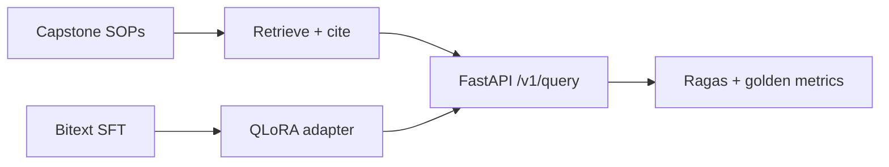

# DomainForge — Governed Support Triage Pipeline

[](https://www.python.org/downloads/)
[](LICENSE)

**Fine-tune behavior, retrieve facts** — QLoRA for strict JSON triage + RAG over capstone SOP corpus, with a unified S0→S3 eval harness.

| Layer | Repo | Live |
|-------|------|------|
| Knowledge (RAG) | [enterprise_rag_platform](https://github.com/vpeetla-ai/enterprise_rag_platform) | [enterprise-rag-platform-eta.vercel.app](https://enterprise-rag-platform-eta.vercel.app) |
| **This project** | `domainforge-rag-peft` | [domainforge-rag-peft.vercel.app](https://domainforge-rag-peft.vercel.app) |
| Inference education | [vllm-architecture-lab](https://github.com/vpeetla-ai/vllm-architecture-lab) | [vllm-architecture-lab.vercel.app](https://vllm-architecture-lab.vercel.app) |

## Problem

Support automation needs **grounded citations** from SOPs and **reliable JSON** for routing — base models hallucinate field names and invent `chunk_id`s.

## Architecture (60s)



**Separation:** RAG = facts · PEFT = schema / intent / action codes ([ADR-001](docs/adr/ADR-001-rag-vs-peft-separation.md) · [ADR-019](https://github.com/vpeetla-ai/ai-architecture-portfolio/blob/main/adr/ADR-019-rag-facts-peft-behavior.md))

## Honest status

| Component | Status |
|-----------|--------|
| SOP corpus ingest + chunking | **Implemented** |
| Bitext → ChatML SFT prep | **Implemented** (CLI) |
| S2 hybrid BM25 + lexical RAG | **Implemented** (`RETRIEVER_MODE=hybrid`) |
| QLoRA training (TRL + PEFT) | **Implemented** (`domainforge-train`) |
| Adapter registry + promote API | **Implemented** |
| Ollama JSON inference | **Implemented** (`MOCK_LLM=false`) |
| Live API (Render) | **Live** — [domainforge-api.onrender.com](https://domainforge-api.onrender.com) |
| Live UI (Vercel) | **Live** — [domainforge-rag-peft.vercel.app](https://domainforge-rag-peft.vercel.app) |
| Full Mistral QLoRA on GPU | Requires CUDA + `make train` |
| vLLM production serve | Planned |

## Data

| Plane | Source | Files |
|-------|--------|-------|
| RAG | Capstone SOPs | 13 Markdown docs in `data/corpus/sop_documents/` |
| SFT | [Bitext HF dataset](https://huggingface.co/datasets/bitext/Bitext-customer-support-llm-chatbot-training-dataset) | `make fetch-bitext` |

## Quick start

```bash
python -m venv .venv && source .venv/bin/activate
pip install -e ".[dev]"
make chunk-sops
make test
make eval-compare
make api   # http://localhost:8090/health
```

**QLoRA training (CPU smoke / GPU production):**

```bash
pip install -e ".[train]"
make train-dry          # validate tokenization
make train-tiny         # 3-step smoke on tiny-gpt2 (CPU)
# GPU: domainforge-train train --max-steps 200
```

**UI (Vercel / local):**

```bash
make api                # terminal 1
cd ui && NEXT_PUBLIC_API_URL=http://localhost:8090 npm run dev   # terminal 2
```

**Full SFT splits (requires network):**

```bash
pip install -e ".[dev,prep]"
make fetch-bitext
make manifest
```

## Solution ladder (eval)

| ID | Description |
|----|-------------|
| S0 | Base model, no retrieval |
| S1 | Naive RAG (Chroma + cosine) |
| S2 | Hybrid governed RAG |
| S3 | PEFT + S2 |

```bash
domainforge-eval --golden data/eval_golden/sample.jsonl --solution s0_baseline
```

## API

| Method | Path | Description |
|--------|------|-------------|
| GET | `/health` | Liveness |
| GET | `/v1/adapters` | Adapter registry (stub) |
| POST | `/v1/query` | Retrieve SOP chunks for a message |
| POST | `/v1/eval/run` | Score golden set (`generate=true` for live S0/S1) |
| POST | `/v1/eval/compare` | S0 vs S1 delta table |
| GET | `/v1/metrics` | Corpus stats |

## Project layout

```
domainforge-rag-peft/
├── domainforge/     # prep, eval, rag, schemas
├── api/             # FastAPI
├── data/            # corpus, manifests, golden eval
├── docs/adr/
└── tests/
```

## Portfolio

Part of [vpeetla-ai](https://github.com/vpeetla-ai) governed stack · Case study: [domainforge-rag-peft.md](https://github.com/vpeetla-ai/ai-architecture-portfolio/blob/main/case-studies/domainforge-rag-peft.md) · Spec: [ENTERPRISE_RAG_PEFT_PIPELINE.md](https://github.com/vpeetla-ai/venkat-ai-portfolio/blob/main/docs/projects/ENTERPRISE_RAG_PEFT_PIPELINE.md)

## License

MIT
