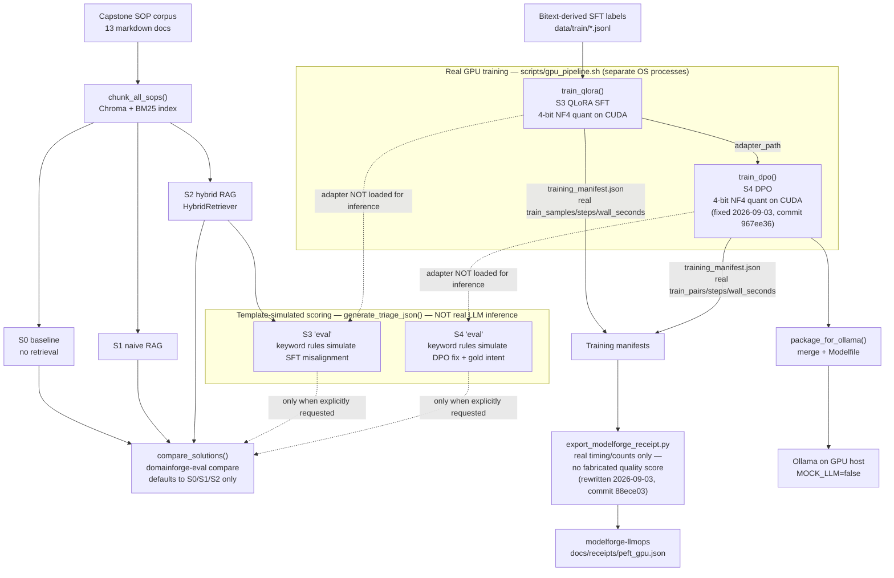

# Architecture — training pipeline

This document covers the **training/eval pipeline** in depth: `data/corpus/sop_documents`
through S0–S4 retrieval baselines, QLoRA SFT (S3), DPO (S4), the eval harness, and Ollama
export. For the request-time serving architecture (FastAPI, RAG/PEFT/gateway planes), see
the diagram in [`README.md`](../README.md#architecture) and the canonical
[`docs/diagrams/canonical-architecture.mmd`](diagrams/canonical-architecture.mmd).

Grounded in, as of this writing: `domainforge/train/qlora.py`, `domainforge/train/dpo.py`,
`domainforge/train/pipeline.py`, `scripts/gpu_pipeline.sh`, `domainforge/eval/runner.py`,
`domainforge/eval/cli.py`, `domainforge/generation/baseline.py`, and
`scripts/export_modelforge_receipt.py`.

## Pipeline

**Read the dotted arrows literally.** Real GPU training (`train_qlora()` / `train_dpo()`,
solid arrows in the `gpu` subgraph) produces a real trained LoRA adapter and a real
`training_manifest.json` with measured example/pair counts, step counts, and wall-clock
time. That adapter is registered (`adapters/registry.json`) and exported to Ollama — but
it is **not** loaded back in for the S3/S4 rows of `domainforge-eval compare`. Every
solution in the eval harness, S0 through S4, is scored through
`domainforge/generation/baseline.py:generate_triage_json()`, which its own docstring
calls a "template generator ... before a real LLM or PEFT/DPO adapter is wired." For
S3 it applies a keyword rule (`"hack"` / `"ignore instructions"` → forced wrong
citation) to simulate SFT misalignment; for S4 it just uses the gold intent to
simulate a DPO fix. **The training is real. The S3/S4 quality numbers in
`data/eval/results/` are not** — they are fixtures/simulator output, not a trained
adapter's actual generations scored against the golden set.

`export_modelforge_receipt.py` (rewritten 2026-09-03) reflects this honestly: it reports
only what the manifests actually measured (example/pair counts, steps, wall-clock
seconds) and explicitly omits any quality/win-rate claim, carrying a `known_gaps` field
that says so.

## Known gaps (dated, with commits)

- **2026-09-03 — DPO CUDA OOM, wrong root cause fixed twice before the real one.**
  A real run on a 22GB L4 GPU OOM'd during DPO. Two attempts didn't fix it: an explicit
  `gc.collect()`/`torch.cuda.empty_cache()` between SFT and DPO in `pipeline.py`
  (commit `3895bfd`), then decomposing `gpu_pipeline.sh` into separate SFT/DPO/eval OS
  processes so DPO starts with a guaranteed-clean CUDA context (commit `c7d9eb9`). Both
  still OOM'd at the same ~22GB mark, proving the bug lived inside `train_dpo()` itself:
  it was loading the full Mistral-7B-Instruct-v0.3 in unquantized `torch.float32`
  (~28GB of weights alone) with no `BitsAndBytesConfig`, no `device_map`, and no
  `prepare_model_for_kbit_training` — none of the 4-bit QLoRA machinery `train_qlora()`
  already applied correctly for SFT. Fixed by mirroring that same quantization path in
  `train_dpo()`, gated on `device == "cuda"` so the CPU/`--tiny` smoke path is untouched.
  [`967ee36`](https://github.com/vpeetla-ai/domainforge-rag-peft/commit/967ee3685b5f598362fd37f37e664d77632827c1)

- **2026-09-03 — receipt exporter was reading 4-month-old fixture files, not real
  training output.** `data/eval/results/s3_peft_hybrid.json` and `s4_dpo_peft.json` were
  committed fixtures from commit `5979663` (Jul 6), copy-pasted from `s0_baseline.json`
  and never regenerated — `domainforge-eval compare` only scores S0/S1/S2 by default (see
  `domainforge/eval/runner.py:compare_solutions()`). `export_modelforge_receipt.py` was
  reading `--s3`/`--s4` quality numbers from those stale files and presenting them as the
  current run's adapter quality — a real GPU training receipt wrapped around unrelated
  placeholder numbers. The rewrite sources real numbers straight from each stage's own
  `training_manifest.json` and drops the quality/win-rate claim entirely rather than
  fabricate one, adding the `known_gaps` field described above.
  [`88ece03`](https://github.com/vpeetla-ai/domainforge-rag-peft/commit/88ece036ddd60d34f6a9ce2d69ec9c179d35be5c)

- **Real GPU training completed, on an L4, 2026-09-03.** SFT: 378 training examples,
  200 steps, ~14 minutes wall-clock. DPO: 16 preference pairs, 100 steps, ~17 minutes
  wall-clock, continuing from the SFT adapter. This produced real
  `adapters/domainforge-triage-v0/training_manifest.json` and
  `adapters/domainforge-triage-dpo-v0/training_manifest.json` files on the training host.
  The `adapters/registry.json` committed to this repo still reflects an earlier CPU/tiny
  smoke run (`sshleifer/tiny-gpt2`, 2 steps) from the Jul 7 test suite, not this GPU run —
  the real run's adapters and manifests live on the GPU host / RunPod volume, not in this
  repo (adapter weights are gitignored; see `.gitignore`).

- **S3/S4 quality scoring is not wired to real inference.** As described above, this is a
  known, deliberately-disclosed limitation of `generate_triage_json()`, not a bug. Wiring
  real adapter inference (load the trained LoRA, generate, then score against the golden
  set) into the eval path remains open work.
